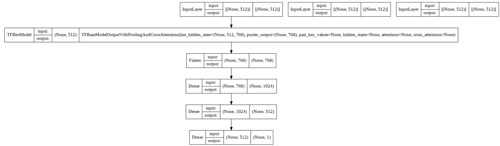
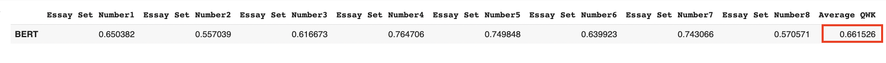

# Automated Essay Scoring

## Team Members: 
Vedhas Vinjamuri, Kratika Shetty

## Background and Motivation
In any language exam, the ability to write composition is an essential indicator of academic performance. However, assessing these essays is a difficult task. The demand for objective and speedy scoring has prompted the development of a tool that can evaluate essays.

There has been a substantial amount of study on the topic of automated essay scoring. One of the early publications uses logistic regression and SVMs on essay representations to get a decision boundary. These models treat the problem as a multi-class classification task. Due to the recent developments in deep learning models and word embedding techniques, there has been significant improvement in the performance of Automated Essay Scoring tools.

## Dataset
### The Hewlett Foundation Data
We used the data available on [Kaggle](https://www.kaggle.com/competitions/asap-aes/data) Competition conducted by The Hewlett Foundation. There are eight essay sets available for this competition. A single prompt was used to produce each batch of essays. 

  
   

### Columns

| Column |Description|
|-------|--------|
| essay_set | 1-8, an id for each set of essays |
| essay | The ascii text of a student's response |
| rater1 domain1 | Rater 1's domain 1 score |
| rater2 domain2 | Rater 2's domain 1 score |
| domain1_score |  Resolved score between the raters; all essays have this | 

## Exploratory Data Analysis

### Essay Set Distribution 

Essays are not equally distributed in the dataset. Different essay sets have different number of essays available. 

The scores for each prompt have different scoring criteria. Minimum and Maximum score that can be graded for each essay is different.

  
   

## Implementation

Since we are using a Dataset from a kaggle competition, we were unable to to get the true Y values for the test data. We split the trainng data as follows to get the training and test data.

**Training Data** 80% of the Data.
**Test Data** 20% of the Data.

### Embedding + LSTM
The LSTM method utilizes Word2Vec to convert the essays into word embeddings. These vectors are then sent through an LSTM-based model which assigns it a final score. The model summary can be seen below:

   

This model is then trained using a 5-fold Cross-Validation technique, and the average Kappa is calculated.

The results for this procedure are seen below:

  

### BERT Model

A Transformer based BERT base model followed by two fully connected feed forward layers and a final dense layer was implemented. Unlike LSTMs which process each sequence element in turn, the Transformer processes all elements at the same time by using an attention mechanism to build direct connections between individual elements. 

Raw essay texts are transformed into three embeddings using a pre-trained BERT text tokenizer. It converts raw text into following embeddings - 
Position Embeddings, Segment Embeddings and Token Embeddings. These embedding tensors are then passed to pretrained encoder of BERT model. The encoded output is then passed on to 3 Fully Connected feedforward layers each with 1024, 512 and 1 neurons. Final output layer has a sigmoid activation which outputs a value between 0 and 1.

#### Model Design

  

Following Quadratic Weighted Kappa was obtained - 

  

## Conclusion

1. LSTM model performed better than the BERT model. 
2. Quadratic Weighted Kappa of LSTM was higher than that of BERT Model. The higher the kappa value, the better model’s prediction aligns with human-graded scores
3. Further optimizations in our hyperparameters or architecture in BERT Model could lead better results.
4. Bert was trained for 100 epochs, training for higher numbers of epochs could also lead to better results.

| | LSTM | Bert |
|-------|--------|--------|
| Quadratic Weighted Kappa | 0.94 | 0.6615 |

## GitHub Repository -  

Here is the link for the [repository](https://github.com/kratikashetty/CS547-Information-Retrieval) 

### References
1. https://www.analyticsvidhya.com/blog/2021/12/googles-bert/
2. https://medium.com/institute-for-applied-computational-science/automated-essay-grading-7bc6cb8ac0b5
