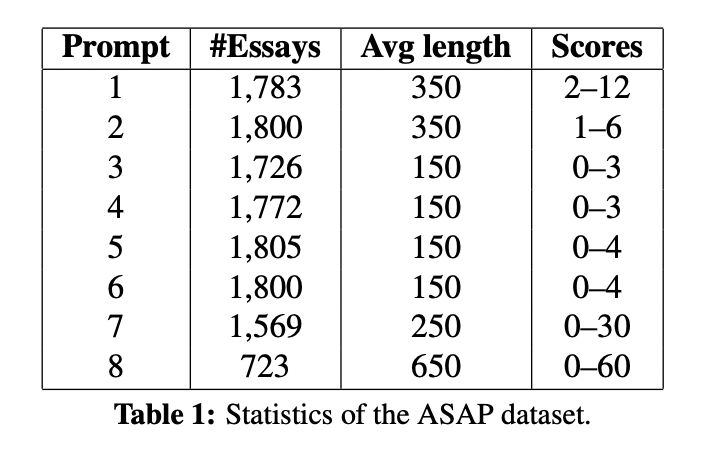
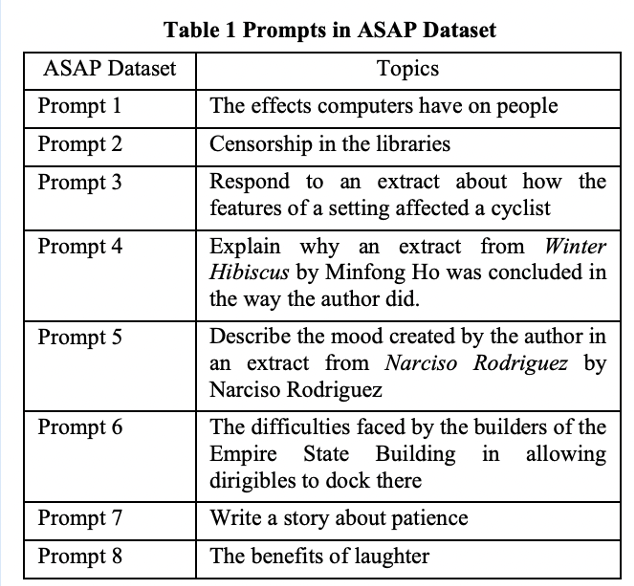
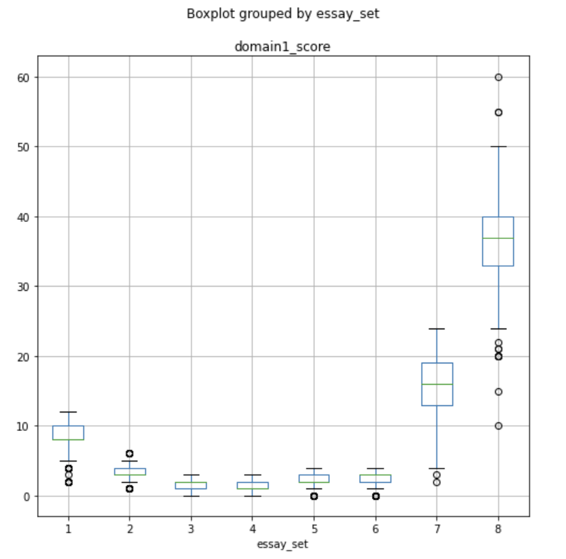
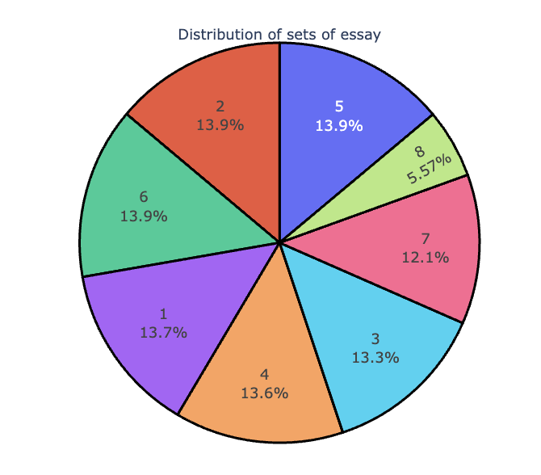
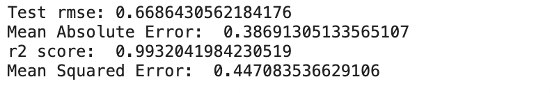
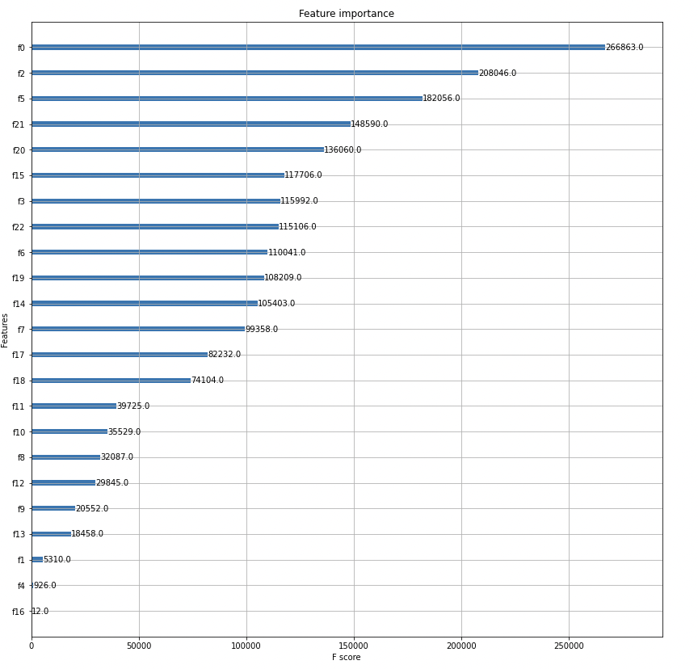
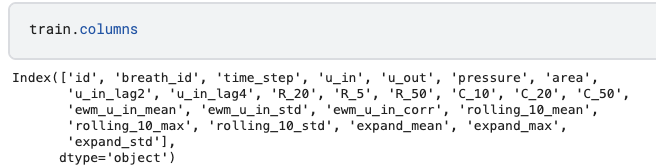
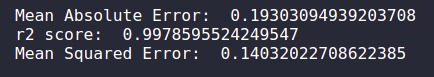

# Automated Essay Scoring

## Team Members: 
Vedhas Vinjamuri, Kratika Shetty

## Background and Motivation
In any language exam, the ability to write composition is an essential indicator of academic performance. However, assessing these essays is a difficult task. The demand for objective and speedy scoring has prompted the development of a tool that can evaluate essays.

There has been a substantial amount of study on the topic of automated essay scoring. One of the early publications uses logistic regression and SVMs on essay representations to get a decision boundary. These models treat the problem as a multi-class classification task. Due to the recent developments in deep learning models and word embedding techniques, there has been significant improvement in the performance of Automated Essay Scoring tools.

## Dataset
### The Hewlett Foundation Data
We used the data available on [Kaggle](https://www.kaggle.com/competitions/asap-aes/data) Competition conducted by The Hewlett Foundation. There are eight essay sets available for this competition. A single prompt was used to produce each batch of essays. 

  
   

### Columns

| Column |Description|
|-------|--------|
| essay_set | 1-8, an id for each set of essays |
| essay | The ascii text of a student's response |
| rater1 domain1 | Rater 1's domain 1 score |
| rater2 domain2 | Rater 2's domain 1 score |
| domain1_score |  Resolved score between the raters; all essays have this | 

## Exploratory Data Analysis

### Essay Set Distribution 

Essays are not equally distributed in the dataset. Different essay sets have different number of essays available. 

The scores for each prompt have different scoring criteria. Minimum and Maximum score that can be graded for each essay is different.

  
   

## Implementation

Since we are using a Dataset from a kaggle competition, we were unable to to get the true Y values for the test data. We split the trainng data as follows to get the training and test data.

**Training Data** 80% of the Data.
**Test Data** 20% of the Data.

### Embedding + LSTM

XGBoost was first considered for modeling the training data since it can be used for regression predictive modeling. We also used repeated 5-fold cross-validation to evaluate and pressure was found out by averaging pressure across multiple runs. After the training data fit into the XGBoost model, the result is generated shown below:

  

**Feature Importance** Feature Importance provides a score that indicates how useful or valuable each feature was in the construction of the boosted decision trees within the model. Here, the features are automatically named according to their index in the input array. Columns id, time_step and u_out have the top three importance score. 

  
 

Here top 3 features fO, f2, f5 corresponds to id, time_step and u_out.

### BERT Model

A Transformer based BERT model followed by two fully connected feed forward layers and a final dense layer was implemented. Unlike LSTMs which process each sequence element in turn, the Transformer processes all elements at the same time by using an attention mechanism to build direct connections between individual elements. 

Raw essay texts are transformed into three embeddings using a pre-trained BERT text tokenizer.

A language model which is bidirectionally trained can have a deeper sense of language context and flow than single-direction language models.

5-fold cross validation was performed and avaerage pressure was calculated after 5 runs.

Model parameters - 
 * Bi-LSTM - 4 Layers
 * 2 Dense Layers in the output layer with ReLu activation

Following Mean Absolute Error, R-squared and Mean Squared Error were obtained - 

  

## Conclusion

1. Bi-LSTM Model performed  better than Xgboost.
2. MAE and MSE of Bi-LSTM model was better than that of Xgboost

| | Bi-LSTM |XGBoost|
|-------|--------|--------|
| Mean Squared Error | 0.1403 | 0.4471 |
| Mean Absolute Error | 0.1903 | 0.387 |

4. Good scores were obtained with 3 to 5 layers Bi-LSTM layers.

## GitHub Repository -  

Here is the link for the [repository](https://github.com/anamika1302/CS539-Ventilator-Pressure-Prediction) 

### References
1. https://machinelearningmastery.com/xgboost-for-time-series-forecasting/
2. https://www.kaggle.com/theoviel/deep-learning-starter-simple-lstm 
3. https://medium.com/geekculture/10-hyperparameters-to-keep-an-eye-on-for-your-lstm-model-and-other-tips-f0ff5b63fcd4
4. https://www.kaggle.com/ranjeetshrivastav/ventilator-pressure-prediction-xgboost/notebook
